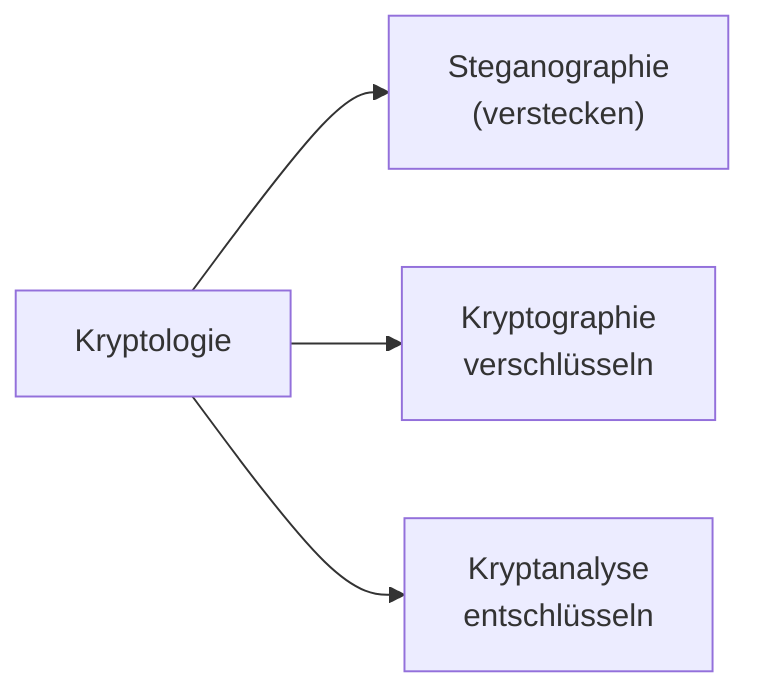

# IT-Security
- [IT-Security](#it-security)
- [Einführung](#einführung)
  - [Safety](#safety)
  - [Security](#security)
  - [Cybercrime](#cybercrime)
- [Kryptologie](#kryptologie)
  - [Kryptographie](#kryptographie)
    - [symmetrische Kryptographie](#symmetrische-kryptographie)


# Einführung
## Safety
...

## Security  
Sicherheit vor (gezielten) Störungen von außen. 

...

- Authentizität
- Integrität
- nicht-Abstreitbarkeit
- Verbindlichkeit
- Verfügbarkeit
- Privatsphäre
- Vertraulichkeit


**Authentifizierung** <br>
Nachweis der Identität (Shared Secret, Biometrie, ...). 

**Verfügbarkeit** <br>
Vorhergesagte Nutzung durch vorhergesehene Nutzer ist möglich. 

**Privatsphäre** <br>
Grundrecht auf informationelle Selbstbestimmung (DSGVO), technisch hilft Anonymisierung.


## Cybercrime
...

# Kryptologie
Ist die Wissenschaft von der Verschlüsselung und Entschlüsselung von Informationen.



**Stenanographie** <br>
Technische Stenanographie ist zum Beispiel die Manipulation von Bild-, Audio- und Videodateien sowie Verstecken weiterer Dateien. 

## Kryptographie
Verschlüsselung von Informationen.

### symmetrische Kryptographie
Zum Beispiel Caesa oder ROT13 - z.B.Verschiebung des Alphabets um einen bestimmten Wert. 
Kryptanalyse mit Mono-, Bi oder Trigrammen sowie Brute-Force möglich.

```python
# Verschiebung um 3
ABCDEFGHIJKLMNOPQRSTUVWXYZ
XYZABCDEFGHIJKLMNOPQRSTUVW
# mit Caesar
Gdv lvw hlq Ehlvslho.
Das ist ein Beispiel.
```

...RC4 (S.94)

...Electronic Code Book Mode (S.98) 

...Cipher Block Chaining Mode (S.100)

...Cipher Feedback Mode (S.102)

**Data Encryption Standard** <br>
DES (USA, 1977) ist ein symmetrisches Blockchiffre mit 64 Bit Blockgröße (davon 56 Bit Schlüssel und 8 Bit Parität).

```
noch nicht geprüft

graph TD
    A[64bit Klartext] --> B[Eingangspermutation]
    B --> C[L-Block 32bit]
    B --> D[R-Block 32bit]
    D --> E[Expansion 48bit]
    E --> F[XOR]

    Q[64bit Schlüssel] --> R[Schlüssel-Permutation]
    R --> S[C-Block 28bit]
    R --> T[D-Block 28bit]
    T --> U[Schlüsselauswahl 48bit]
    S --> U
    
    U --> F
    F --> G[S1, S2, S3, ..., Sn]
    G --> H[Permutation 32bit]
    H --> I[XOR]

    C --> I
    I --> D
    I --> J[Ausgangspermutation 64bit]
    J --> K[Chiffretext 64bit]
```

**3DES** <br>
3DES ist eine Erweiterung von DES. 

**International Data Encryption Algorithm** <br>
IDEA ist eine symmetrische Blockchiffre mit 128bit-Schlüssel und 64bit-Blöcken, jeweils 8 Runden. 

**Advanced Encryption Standard** <br>
AES wurde 2000 "in Dienst gestellt" und ist eine symmetrische Blockchiffre mit 128bit-Blockgröße verschiedenen Schlüssellängen (128, 160, 192, 224, 256bit).

[Animation](https://www.cryptool.org/de/cto/aes-animation) & [Step-by-Step](https://www.cryptool.org/de/cto/aes-step-by-step)

**sicherer Schlüsselaustausch** <br>
Diffie-Hellman 

